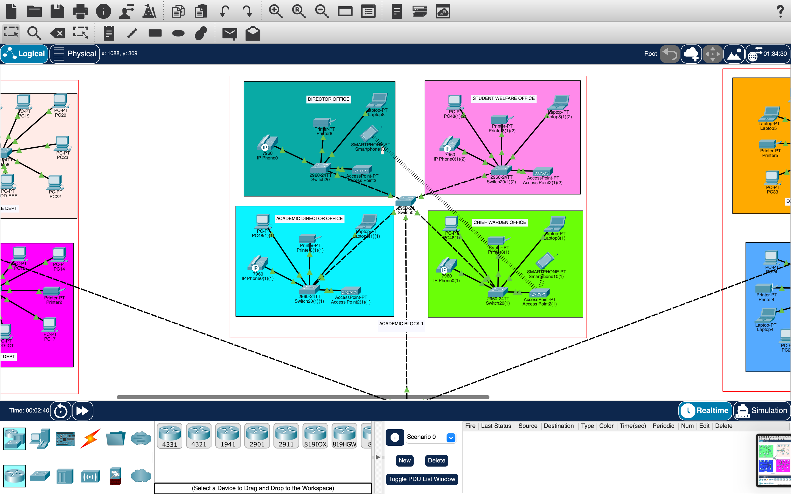

# Campus Cyber Security Enhancement Project - Cisco Virtual Internship

## Overview
This repository contains the necessary files and documentation for the Campus Cyber Security Enhancement Project conducted as part of the Cisco Cyber Security Industry Problem Statement for the Virtual Summer Internship Program 2024. The project focuses on analyzing and enhancing the cyber security measures in place at the Manipal Institute of Technology campus network.

## Project Components

### 1. Network Analysis and Mapping
- **Objective**: Analyze the existing campus network to identify the current security controls, including intrusion detection systems, firewalls, and authentication mechanisms.
- **Tools Used**: Cisco Packet Tracer for network topology visualization and mapping.

### 2. Attack Surface Mapping
- **Objective**: Conduct a comprehensive attack surface mapping to identify potential vulnerabilities and propose effective countermeasures.
- **Details**: The analysis includes identifying open ports, weak passwords, and outdated firmware, and proposes upgrades to encryption protocols and firewall configurations.

### 3. Hybrid Working Environment
- **Objective**: Design and architect a secure hybrid working environment for faculty and students that ensures secure access both on-campus and remotely.
- **Solutions Proposed**: Implementation of VPNs, Network Access Control (NAC), Multi-Factor Authentication (MFA), and Cloud Access Security Broker (CASB).

### 4. Content Access Restriction
- **Objective**: Develop a network solution that restricts access to non-educational websites and ensures that only approved web content is accessible by students.
- **Technology Used**: Deployment of Cisco Umbrella for DNS filtering and Cisco Firepower for enhanced firewall protection.

## Network Topology Screenshots

### Campus Network Topology Screenshots
Here are the visual representations of the campus network topology as designed in Cisco Packet Tracer, located in the `screenshots` folder.

#### Screenshot 1: CSE and EEE Departments

#### Screenshot 2: Director and Academic Offices

#### Screenshot 3: Student Welfare and Chief Warden Offices

#### Screenshot 4: Library and Academic Blocks

#### Screenshot 5: Hostels and Service Rooms

## Files Included in the Repository
- **Packet Tracer Network File**: A `.pkt` file containing the simulated network topology.
- **Cyber Security Project Report**: A comprehensive document detailing the network analysis, proposed enhancements, and the reasoning behind each security measure.
- **Problem Statement PDF**: Outlines the tasks and deliverables expected for the project.

## Installation and Usage
- **Cisco Packet Tracer**: To view the `.pkt` file, Cisco Packet Tracer must be installed. This software allows for the simulation and testing of network setups.
- **PDF Viewer**: A PDF viewer is needed to open the project report and problem statement documents.

## Contributing
Contributions to this project are welcome. Please fork the repository and submit a pull request with your proposed changes.

## Contact
For any inquiries or further assistance regarding this project, please contact:

- **Name**: Aditya Raj
- **Email**: [adityaraj006005@gmail.com](mailto:adityaraj006005@gmail.com)

## License
This project is licensed under the MIT License - see the [LICENSE.md](LICENSE.md) file for details.
